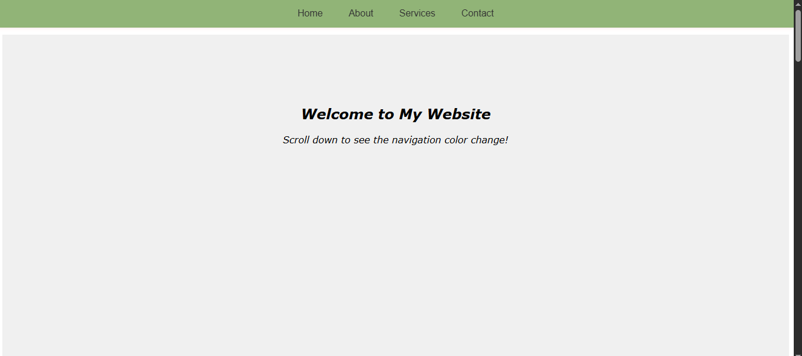

# Interactive Navigation Menu

 

A simple responsive navigation bar that changes style on scroll and hover. Built with HTML, CSS, and vanilla JavaScript.

## Features

- 🚀 Fixed-position navigation that stays visible
- 🎨 Dynamic color change when scrolling
- ✨ Smooth hover effects on menu items
- 📱 Responsive design
- ⚡ Pure JavaScript (no libraries required)

## How to Use

1. Clone the repository:
   ```bash
   git clone https://github.com/your.git
